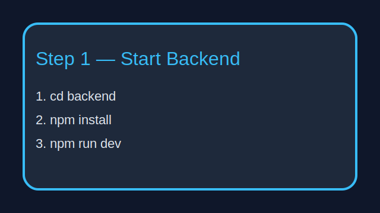
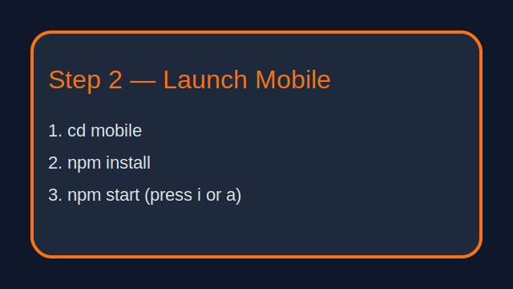

# Base44 Quick Reference

Use this mini-guide when you just need the essentials. Keep the backend terminal and Expo window open while testing.

**Backend Startup**
1. `cd backend`
2. `npm install`
3. `npm run dev`

**Mobile App Startup**
1. `cd mobile`
2. `npm install`
3. `npm start` → press `i` (iOS) or `a` (Android)

**Activate & Chat**
1. Scan the front of your ID and accept the disclaimer.
2. Tap “Activate Secure Access” on the paywall.
3. Choose a persona and start chatting.

**Panic Wipe**
- In the persona gallery tap “Activate Panic Wipe” to clear tokens, chat history, and device IDs.

**Common Fixes**
- Mobile can’t connect? Update `mobile/app.json` → `extra.apiBaseUrl` with your backend URL.
- Venice errors? Confirm `VENICE_API_KEY` in `backend/.env` and restart the server.
- Subscription missing? Run the paywall activation button again; entitlements reset when backend restarts.

Tape this next to your monitor for fast reference.
